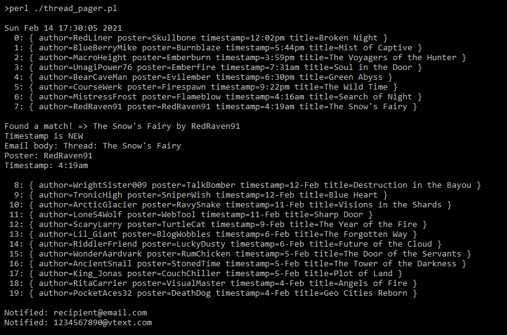
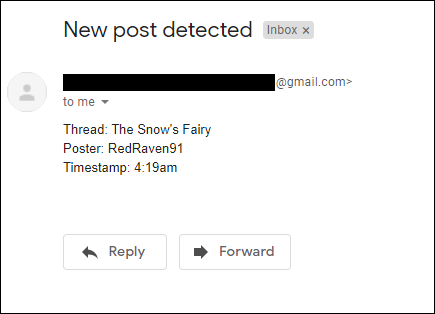

# thread_pager

## Introduction

This Perl script sends a notification email if the original poster (OP) posts in their forum thread.
<br><br>

## Requirements
  - Turn on "Allow less secure apps" in your Google Account preferences to enable sending
    over Gmail SMTP.
  - Modify the values in the "REQUIRED CUSTOMIZATIONS" section in the script.

## Procedure:
  - Run the script using Perl 5 version 28 or higher.
```
Usage: thread_pager.pl
```
<br><br>
  
## Example Execution

<p align="center">

</p>
<br><br>

## Example Notification Email

<p align="center">

</p>
<br><br>

## Automation

The script can be run using Unix/Linux cron or Windows Task Scheduler.
```
### Run every hour using cron
0 * * * * cd /home/user/scripts && /usr/bin/perl /home/user/scripts/thread_pager.pl > /home/user/scripts/listener.log 2>&1
```
